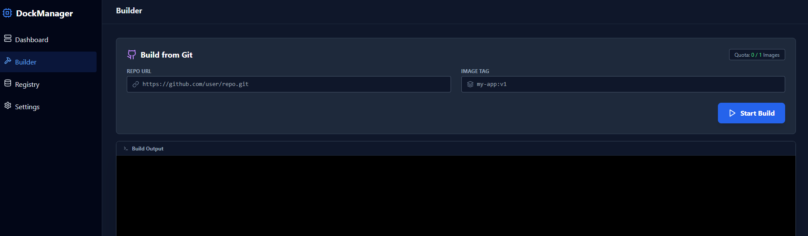
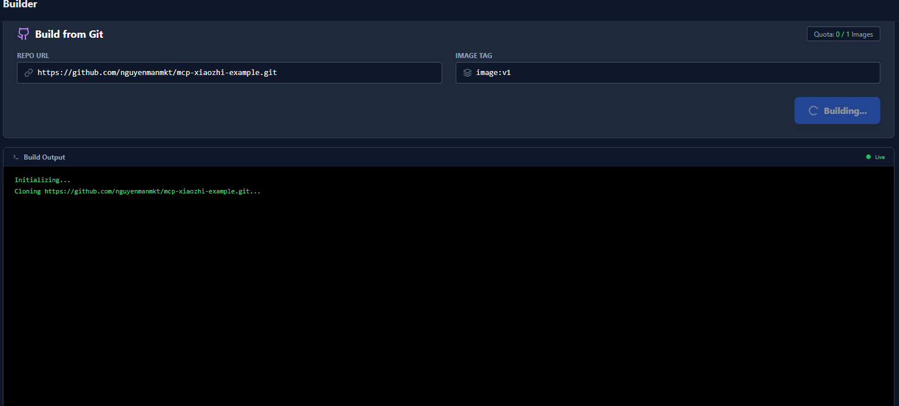
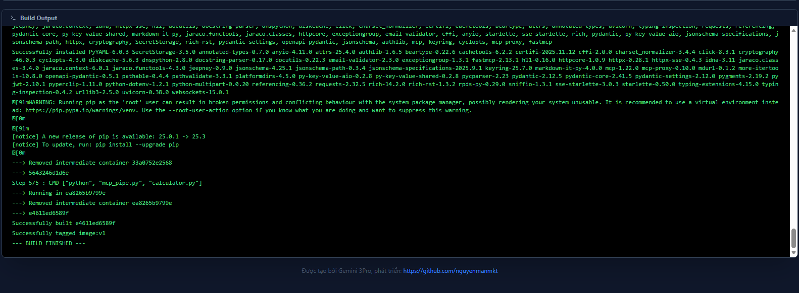
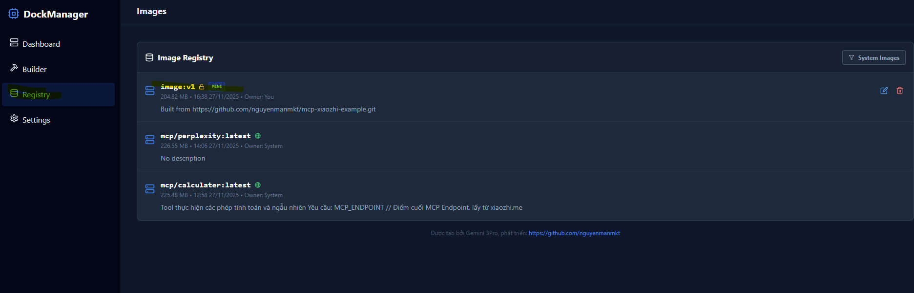

# Tự build một image riêng 

- Tạo một dự án github với mẫu : https://github.com/nguyenmanmkt/mcp-xiaozhi-example

- Truy cập Builder

- Chèn link dự án của bạn vào, nhập tên Imange và version: image:v1

- Start Build : đợi logs báo thành công

- Kiểm tra image vừa tạo tại mục Reistry

- Có thể phân quyền public hoặc private cho image của bạn

- Có thể tiến hành tạo mcp-server từ image của bạn : https://github.com/nguyenmanmkt/mcp-server/blob/main/docs/run-mcp.md